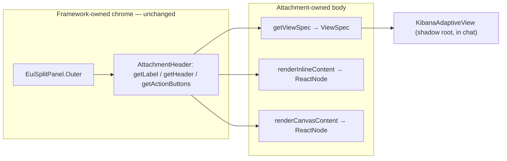

# Adaptive UI body seam for existing Agent Builder attachments

**Status:** landed on this branch (contract + native `getViewSpec` adopters) · **Owner:** `@elastic/appex-ai-infra` (Adaptive UI) · **Reviewers:** `@elastic/security-generative-ai` / Agent Builder core

## Summary

`getViewSpec(attachment)` is an optional resolver on the browser attachment contract (`AttachmentUIDefinition`). When a type supplies it, Agent Builder renders the attachment **body** by mounting the returned `ViewSpec` through Adaptive UI, while the type keeps its existing header, badges, and action buttons. This is the "alternative render" path for already-registered attachment types: it needs no new attachment registration, no allow-list entry, and no change to any type's server contract — only an opt-in on the browser UI definition.

It sits beside the two paths this branch already ships:

- `platform.adaptiveUi.view` attachment — a **new** type whose whole body is a `ViewSpec`. Production-shaped, but only for content authored as Adaptive UI from the start.
- `view` renderer (`<render type="view">`) — agent-authored views inside a markdown response, no chrome.

The first adopter is `platform.sig_event`. Presentational Figma types on this branch also set `getViewSpec` (`text`, `esql`, `case`, `cases`, `security.rule`, alerting rule/policy, workflow YAML/diff, detections/KI, entity analytics / risk history). Interactive types (`graph`, `skill`, `connector_setup`) keep their React bodies.

## Where the seam goes

Agent Builder already splits chrome from body the same way Adaptive UI splits `PackChrome` (host-supplied frame) from `renderBody` (pack-supplied body).

In [`inline_attachment_with_actions.tsx`](../../x-pack/platform/plugins/shared/agent_builder/public/application/components/conversations/conversation_rounds/round_response/attachments/inline_attachment_with_actions.tsx) the framework owns an `EuiSplitPanel.Outer` plus an `AttachmentHeader` (icon, title, badges, right-aligned action buttons); the attachment owns only the inner body. The relevant members of [`AttachmentUIDefinition`](../../x-pack/platform/packages/shared/agent-builder/agent-builder-browser/attachments/contract.ts) are:

- chrome: `getLabel`, `getHeader` (`icon` / `subtitle` / `badges`), `getActionButtons`, `getMaxWidth`
- body: `getViewSpec`, `renderInlineContent` (inline), and `renderCanvasContent` (flyout)



## Contract

One optional method, additive and backward compatible:

```ts
getViewSpec?: (attachment: TAttachment) => ViewSpec | undefined;
```

**Precedence** (deliberate — not "replace both"):

- **Inline:** `getViewSpec` wins, else `renderInlineContent`. Header-only only when neither exists.
- **Canvas:** keep `renderCanvasContent` when present. Fall back to `getViewSpec` only if canvas is unset.

Return `undefined` from `getViewSpec` to fall back to the React renderers for a given attachment.

## What renders the body

[`AttachmentAdaptiveBody`](../../x-pack/platform/plugins/shared/agent_builder/public/application/components/conversations/conversation_rounds/round_response/attachments/attachment_adaptive_body.tsx) wraps [`KibanaAdaptiveView`](../../src/platform/packages/shared/adaptive-ui/react.ts) from `@kbn/adaptive-ui/react` inside `agent_builder`. That component already owns base-path rewriting of internal `href`s and mapping `EuiThemeColorMode` to the Adaptive UI render theme. No new shared package; `agent_builder` takes a `kbn_reference` on `@kbn/adaptive-ui`.

It mounts the `html` surface, which inlines the view's CSS into a shadow root. The `react` surface renders into the light DOM and only carries the component classes, so it needs the host to load `@kbn/adaptive-ui/styles.css` — the `adaptiveUi` plugin does that behind `xpack.adaptiveUi.styleIsolation: document`, but that config is not visible to `agent_builder`.

## The header quirk

`AttachmentHeader` returns `null` when a type has no action buttons, which is why [`cases`](../../x-pack/platform/plugins/shared/cases/public/agent_builder/attachments/cases_attachment_definition.tsx) draws its own nested header panel today. A `getViewSpec` body inherits the same rule: if a type opts into an Adaptive UI body but supplies neither `getActionButtons` nor `getHeader`, it renders a headerless card. The seam does not change this — types adopting it either keep their existing `getActionButtons`/`getHeader` (the common case, since the point is to keep chrome) or let the `ViewSpec` carry its own heading node.

## First adopter: `platform.sig_event`

[`significant_event_attachment.tsx`](../../x-pack/platform/plugins/shared/significant_events_app/public/components/significant_event_attachment/significant_event_attachment.tsx) sets `getViewSpec` to [`toSignificantEventAttachmentViewSpec`](../../x-pack/platform/packages/shared/adaptive-ui-adapters/src/sig_event_attachment.ts), which maps canonical Significant Event fields (`title`, `summary`, `status`, `severity`, `event_id`, `event_uuid`, `symptom_hypothesis`, signals) plus a Nightshift href. That mapper is distinct from the streams-shaped [`toSigEventViewSpec`](../../x-pack/platform/packages/shared/adaptive-ui-adapters/src/sig_event.ts) used by the `streams.significantEvent` registered view.

Nightshift **new chat** (landing-row icon, or flyout **New chat about this event**) attaches `platform.sig_event`. Once the agent emits `<render_attachment>`, inline chat shows Adaptive UI. Canvas still runs live ES|QL via `SignificantEventDetails`. Flyout **Open in chat** on an investigated event restores the investigation conversation unless you pick new chat.

Adapters live in [`@kbn/adaptive-ui-adapters`](../../x-pack/platform/packages/shared/adaptive-ui-adapters). Owning plugins import that package and set `getViewSpec`; they do not depend on the `adaptiveUi` plugin for the helpers. Figma attachment replacements as chat attachments: [`adaptive_ui_portable_chat_attachments.md`](./adaptive_ui_portable_chat_attachments.md).

## Adoption path

1. Contract + render-site wiring is in. Types without `getViewSpec` are unchanged.
2. Convert further types by mapping attachment data onto an existing `to<Type>ViewSpec` adapter and setting `getViewSpec`. Keep `getActionButtons` / `getHeader`. Do not keep `renderCanvasContent` only when the flyout should also be Adaptive UI.
3. The same `ViewSpec` also renders to Slack/markdown/PNG off-Kibana via the archetype golden test.

Figma attachment replacements as chat attachments: [`adaptive_ui_portable_chat_attachments.md`](./adaptive_ui_portable_chat_attachments.md).

## Benefits

- Gives a body to types that render nothing in chat today, and a shared visual grammar to types that are independent React implementations.
- One validated `ViewSpec` per type renders to React in chat, Block Kit in Slack, markdown in GitHub, and PNG for export — with no Kibana runtime on the non-React paths.
- Additive and reversible per attachment (`getViewSpec` returning `undefined` falls back), so migration is incremental.

## Risks / follow-ups

- **Interactivity.** Adaptive UI bodies route interactivity through host chrome (action buttons) rather than in-body state; types needing rich in-body interaction (maps, editable tables, live ES|QL) stay on `renderInlineContent` / `renderCanvasContent`. The seam is for presentational bodies.
- **Canvas.** Native canvas wins when set, so a type can keep a live flyout and still ship a portable inline card. Types that want a portable flyout omit `renderCanvasContent`.
