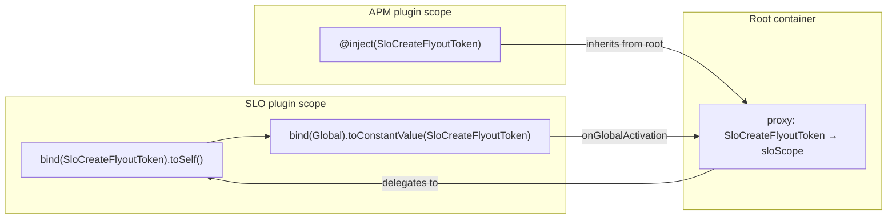

# Global DI for Cross-Plugin Service Sharing: Analysis

This document evaluates the approach taken in the `exploration/di` branch, where
the `Global` token from `@kbn/core-di-internal` is used to publish and consume services
across plugin scopes without declaring `requiredPlugins` or `optionalPlugins`.

---

## How it works

A plugin binds a service to its own scope and marks the token as `Global`.  During
setup, the `PluginModule` machinery registers a proxy binding in the root container
that delegates resolution to the originating plugin scope.  Any other plugin scope,
being a child of root, inherits the proxy and can resolve the service.



Resolution is lazy: the proxy only fires when a consumer actually calls
`container.get(token)`.  In practice this happens during request handling
(server) or component rendering (browser), by which point every plugin has
completed both `setup()` and `start()`.

---

## Use cases

### 1. Cross-plugin UI embedding (browser)

The motivating case.  APM embeds SLO's creation and details flyouts without
declaring `slo` as a plugin dependency.  SLO publishes `SloCreateFlyoutToken`
and `SloDetailsFlyoutToken` globally; APM resolves them via `useSloFlyouts()`.

This pattern applies to any plugin that embeds another plugin's UI components:

- **Observability → Cases**: the observability app embeds cases UI
  (`services.cases?.helpers.canUseCases`, cases modals).
- **Monitoring → Fleet**: the monitoring app renders Fleet asset views
  (`services.fleet?.hooks.epm.getBulkAssets`).
- **Synthetics → SLO**: synthetics embeds SLO features as an optional
  integration.
- **Infra → ML**: the infra app renders ML anomaly detection UI.

Each of these currently uses `optionalPlugins` + optional chaining on the
plugin start contract.  Global DI offers an alternative that moves the
dependency from the plugin graph to the DI container.

### 2. Server-side optional service injection

Numerous server-side routes consume optional plugin services:

- **APM**: `plugins.fleet?.start()`, `plugins.slo?.start()`,
  `plugins.profilingDataAccess?.start()`, `plugins.spaces?.start()`,
  `plugins.taskManager?.start()`.
- **Security Solution**: `plugins.fleet?.registerExternalCallback`,
  `plugins.security?.audit`, `plugins.encryptedSavedObjects?.canEncrypt`.
- **Alerting / Actions / Cases**: `plugins.spaces?.spacesService`,
  `plugins.security?.audit`, `plugins.usageCollection?.createUsageCounter`.

All of these follow the same pattern: check if the optional plugin is
available, call a method on its start contract, handle the `undefined` case.
Global DI can replace this with typed token injection where the `undefined`
check is handled by `{ optional: true }`.

### 3. Breaking circular dependency workarounds

Several existing workarounds exist specifically to avoid circular plugin
dependencies:

- **`task_manager_dependencies`**: a sidecar plugin created to break the
  `taskManager` ↔ `encryptedSavedObjects` ↔ `security` cycle.
- **`cloud_connect`**: a registration pattern to break the
  `cloudConnect` ↔ `management` ↔ `home` cycle.
- **`kbn-securitysolution-t-grid`**: a shared package to break the
  `securitySolution` ↔ `timelines` cycle.
- **`share` locators**: the locator pattern was partially motivated by
  avoiding circular dependencies between navigating plugins.
- **`observability_shared` tier system**: a manual tier hierarchy to prevent
  circular deps between observability plugins, enforced only by convention.

Global DI offers a principled alternative to all of these: extract the
shared contract into a neutral token package and let each plugin bind or
consume the token independently.

### 4. DI-native HTTP routes and browser applications

The DI subsystem already provides first-class support for HTTP routes (via
`Route` from `@kbn/core-di-server`) and browser applications (via
`Application` from `@kbn/core-di-browser`).  These automatically receive
request-scoped services like `Request`, `Response`, and
`ApplicationParameters` via the same `Global` mechanism.  Extending Global
to plugin-authored services is a natural progression of this existing
architecture.

### 5. Shared service registries

Plugins that maintain service registries (e.g. `discoverShared.features`,
`observabilityShared.navigation`, `triggersActionsUi.ruleTypeRegistry`) could
publish individual registry entries via Global tokens, allowing consumers to
inject specific capabilities rather than depending on an entire registry
plugin.

---

## Strengths

### 1. Breaks plugin-graph cycles

Two plugins can consume each other's services without a bidirectional
`requiredPlugins` declaration, which the platform forbids.  This eliminates
the need for sidecar plugins, shared packages that mirror plugin internals,
and manual tier enforcement.

### 2. Backward compatible

The `Global` mechanism coexists with the classic `plugin.setup()` /
`plugin.start()` lifecycle.  A plugin can export both a classic `plugin` and
a DI `module` simultaneously.  Migration can be incremental -- one service at
a time, one consumer at a time.

### 3. Leverages existing infrastructure

No new framework or runtime.  `Global` was already used internally by the
platform for `Request`, `Response`, and `ApplicationParameters`.  Making it
public extends an existing, tested mechanism to plugin authors.

### 4. Type-safe contracts via neutral packages

Service tokens carry their type signature (`ServiceIdentifier<T>`), and the
token + interface live in a neutral package that both the publisher and
consumer depend on.  The consumer never imports the publisher's code directly.

### 5. Naturally testable

In unit tests, a consumer can bind a mock to the token in a test container
without needing the real publisher plugin.  This is simpler than mocking an
entire plugin start contract.

### 6. Consistent optional service pattern

The current codebase has dozens of `plugins.X?.start()` and
`services.X?.someMethod` patterns, each with ad-hoc `undefined` handling.
Global DI standardizes this: `container.get(token, { optional: true })`
provides a uniform, type-safe way to consume optional services.

---

## Weaknesses

### 1. Implicit dependencies replace explicit ones

`requiredPlugins` is machine-readable.  Tools, CI checks, and the platform
itself use it to enforce startup ordering, detect missing plugins, and build
the dependency graph.  Global DI sidesteps all of that.  A plugin's actual
runtime dependencies become invisible to static analysis.

### 2. Runtime failures instead of startup failures

If a provider plugin is disabled or absent, `requiredPlugins` causes a clear
startup error.  With Global DI, the token resolves to `undefined` (or throws,
depending on `{ optional: true }`) only when the consuming code path runs.
This can surface late, in production, in a rarely-exercised code path.

### 3. Discovery problem

There is no registry or manifest of globally published tokens.  A developer
writing a consumer must know which tokens exist, which plugin publishes them,
and what package to import them from.  IDE autocompletion does not help here
because the token is a `Symbol`, not a class.

### 4. The `rebindSync` bridge is a workaround

When a plugin uses the classic `start()` method to create services (as SLO
does for its flyout factories), the DI module cannot access them via the
`Start` token because the classic contract takes precedence and the module's
`Start` binding returns `undefined`.  The `rebindSync` call in `start()` is
a temporal coupling: the module pre-declares `undefined`, and `start()` later
overwrites it.  If anything resolves the token between module load and
`start()`, it gets `undefined`.

### 5. Global namespace pollution

Any plugin can `bind(Global).toConstantValue(anyToken)`.  There is no
governance mechanism (linting, review gate, manifest) to prevent overlapping
tokens, poorly-named symbols, or accidental overwrites.  At scale, the set
of global tokens could become difficult to manage.

### 6. Browser bundle loading is not guaranteed

On the server, all plugins are loaded in the same Node.js process.  On the
browser, plugin bundles are loaded on demand based on the dependency graph.
If APM does not declare SLO as a dependency, the platform has no reason to
load SLO's JavaScript bundle when the user navigates to APM.  The SLO
module that publishes the flyout tokens would never execute, so the tokens
remain `undefined`.

This is the most significant practical limitation for browser-side use cases.
Server-side Global DI does not have this problem because all plugin modules
are loaded during server startup regardless of the dependency graph.

---

## Risks

| Risk | Severity | Mitigation |
|------|----------|------------|
| **Resolution before provider starts.** A consumer resolves a token during `OnSetup` or `OnStart`, before the provider has started and called `rebindSync`. | High | Document and enforce the rule: never eagerly resolve cross-plugin globals in lifecycle hooks.  Use them only in request-scoped services or React components. |
| **Missing provider is silent.** A provider plugin is disabled via config.  The consumer gets `undefined` and may fail with an unhelpful error deep in a render tree. | Medium | Always use `{ optional: true }` and handle the `undefined` case explicitly.  Consider a startup-time health check that logs warnings for unresolved global tokens. |
| **Symbol collision.** Two plugins publish different services under the same `Symbol.for(...)` string. | Low | Adopt a naming convention (e.g. `<pluginId>.<ServiceName>`) and enforce it via code review or a lint rule. |
| **Bundle not loaded (browser).** The publishing plugin's bundle is not loaded because no dependency edge triggers it. | High | For browser use cases, retain the plugin in `requiredBundles` or implement lazy bundle loading. |
| **Platform bypass.** The platform can no longer enforce startup ordering, detect circular dependencies, or produce accurate dependency graphs for tooling. | Medium | Treat Global DI as an opt-in mechanism for optional services, not a wholesale replacement for `requiredPlugins`. |
| **Performance overhead.** Every Global resolution traverses a proxy chain: consumer scope -> root -> proxy -> provider scope. | Low | The proxy is cached `inRequestScope()`, so each token is resolved at most once per request/fork. |

---

## Proposed improvements

These changes would address specific weaknesses and risks without abandoning
the approach.

### A. Platform auto-bridge: bind classic contracts into DI

Modify `PluginWrapper.start()` to bind the classic start contract into the
DI container's `Start` token after resolution.  This eliminates the
`rebindSync` bridge pattern entirely.

```ts
// Proposed change in PluginWrapper.start():
const contract = [
  this.instance?.start(startContext, plugins),
  this.container?.get<TStart>(Start),
].find(Boolean)!;

// Bind the winning contract back into DI.
if (this.container && contract) {
  this.container.rebindSync(Start).toConstantValue(contract);
}
```

A plugin module could then depend on `Start` directly and use it in a
`toResolvedValue` binding to publish individual services globally:

```ts
export const module = new ContainerModule(({ bind }) => {
  bind(SloCreateFlyoutToken).toResolvedValue(
    (start: SLOPublicStart) => start.getCreateSLOFormFlyout,
    [Start]
  );
  bind(Global).toConstantValue(SloCreateFlyoutToken);
});
```

No `rebindSync`.  No temporal coupling.  **Addresses weakness 4.**

### B. `optionalGlobals` manifest field

Add a new field to `kibana.jsonc`:

```jsonc
{
  "plugin": {
    "optionalGlobals": [
      "slo.CreateSLOFormFlyout",
      "slo.SLODetailsFlyout"
    ]
  }
}
```

The platform uses this for:

1. **Startup warnings**: log when a declared global token has no provider.
2. **Browser bundle loading**: ensure the provider plugin's bundle is loaded
   when any consumer plugin loads.
3. **Dependency graph tooling**: include global edges in the plugin graph for
   visualization and cycle detection.
4. **Documentation generation**: auto-generate a manifest of available global
   tokens.

**Addresses weaknesses 1, 2, 3, and 6.**  The manifest makes implicit
dependencies partially explicit again while preserving the decoupling benefit.

### C. Token naming convention with lint enforcement

Adopt the convention `<pluginId>.<ServiceName>` for `Symbol.for()` strings:

```ts
// Good:
Symbol.for('slo.CreateSLOFormFlyout')

// Bad:
Symbol.for('CreateSLOFormFlyout')
Symbol.for('flyout')
```

An ESLint rule can enforce that `Symbol.for()` calls used with
`ServiceIdentifier` follow this pattern.  **Addresses weakness 5 and the
symbol collision risk.**

### D. Runtime health check for global tokens

During `start()`, the platform iterates all declared `optionalGlobals` and
checks whether a provider has bound each token.  Unresolved tokens are logged
at `warn` level:

```
[WARN] Global token "slo.CreateSLOFormFlyout" declared by plugin "apm"
       has no provider.  The SLO plugin may be disabled.
```

This surfaces missing providers at startup instead of at request time.
**Addresses the "missing provider is silent" risk.**

### E. `requiredBundles` as transitional browser solution

Until lazy bundle loading or `optionalGlobals`-driven loading is
implemented, plugins that consume browser-side Global tokens should list the
provider in `requiredBundles`:

```jsonc
{
  "plugin": {
    "requiredBundles": ["slo"]
  }
}
```

This ensures the SLO bundle loads without creating a plugin-graph dependency.
It is already a well-understood pattern used by 20+ plugins today.
**Addresses weakness 6 immediately with no platform changes.**

### F. Lazy bundle loading for Global tokens (longer term)

Extend the browser-side Global mechanism to trigger async bundle loading when
a token is first resolved.  The platform maintains a mapping of global token
-> provider plugin -> bundle URL.  When a consumer resolves the token and the
provider bundle is not yet loaded, the platform loads it on demand, executes
its module, and then resolves the token.

This requires introducing async resolution at the boundary (e.g., a
`useAsyncService` hook that returns `{ loading, service }`) but enables true
decoupling on the browser side.  **Fully addresses weakness 6.**

### G. Global token registry for discoverability

Provide a `core.injection.getGlobalTokens()` API that returns all registered
global tokens with their provider plugin and type information.  This can
power:

- Developer tooling (list available tokens in a UI).
- Auto-generated documentation.
- Runtime introspection for debugging.

**Addresses weakness 3.**

---

## Alternatives

### 1. Shared neutral package (no DI)

Move the shared service into a neutral package that both plugins depend on.
The package exports the implementation directly.

**Pros:** No DI complexity.  Static imports.  Bundle loading is guaranteed.
**Cons:** The service often needs extensive context (core services, plugin
clients, React providers).  Extracting it from the owning plugin is a major
refactor.  The "neutral" package ends up importing the plugin's dependencies,
defeating the purpose.  Does not help when two plugins need each other's
services.

**Best for:** pure utility functions, type definitions, and constants.
Already used widely (e.g. `@kbn/slo-schema`, `@kbn/rule-data-utils`).

### 2. Locator / navigation pattern

Instead of embedding another plugin's UI, navigate the user to the target app
with pre-filled parameters via a
[locator](https://github.com/elastic/kibana/blob/main/src/plugins/share/common/url_service/locators/README.md).

**Pros:** Zero coupling.  Each plugin owns its own UI entirely.  Already
widely adopted (SLO locators, APM locators, Discover locator).
**Cons:** Worse UX for inline embeds -- the user leaves the current context.
Does not work for flyouts, inline panels, or composite views that show data
from multiple plugins simultaneously.

**Best for:** full-page navigation between apps.

### 3. Sidecar plugin pattern

Create a small plugin whose sole purpose is to break a dependency cycle by
owning the shared contract.  Both original plugins depend on the sidecar.

**Pros:** Works within the existing platform model.  No DI knowledge
required.  Static, analyzable dependencies.
**Cons:** Adds a real plugin to the system with its own lifecycle, config,
and maintenance burden.  The sidecar is purely structural -- it exists only
because of a tooling limitation, not a product need.  Already used by
`task_manager_dependencies` and `cloud_connect`.

**Best for:** hard circular dependencies between platform plugins where both
sides have required (not optional) needs.

### 4. Event bus / shared registry

Create a lightweight shared registry where plugins register factories during
`start()`.  Consumers query the registry by key.

**Pros:** Explicit publish/subscribe.  Can log warnings for missing services.
Can be made discoverable.
**Cons:** Reinvents a subset of DI without the type safety, scope isolation,
or lifecycle integration.  Another pattern for developers to learn alongside
both classic contracts and DI modules.  Already partially exists via
`discoverShared.features.registry` and similar ad-hoc registries.

**Best for:** situations where the set of registered items is dynamic and
open-ended (e.g. feature registries, rule type registries).

### 5. Module federation / dynamic imports

Use Webpack Module Federation (or a similar mechanism) to dynamically load
another plugin's exported components at runtime without a build-time
dependency.

**Pros:** True decoupling at both the dependency graph and bundle level.
**Cons:** Major infrastructure investment.  Introduces version skew risks.
Complex error handling.  Not currently part of Kibana's architecture.

**Best for:** micro-frontend architectures, not currently applicable to
Kibana's monorepo model.

---

## Recommendation

Global DI is a viable mechanism for cross-plugin service sharing.  Its
applicability differs by environment:

**Server side**: ready to use today.  All plugin modules load during startup,
so Global tokens are always available.  The pattern is a natural fit for the
dozens of `plugins.X?.start()` patterns across the codebase.

**Browser side**: viable with `requiredBundles` as a transitional measure
(improvement E).  The provider bundle loads, the token is populated, and
the consumer resolves it.  Long-term, `optionalGlobals` (improvement B) or
lazy bundle loading (improvement F) would eliminate the need for any
dependency declaration.

**Immediate next steps** (no platform changes required):

1. Adopt `requiredBundles` for browser-side Global consumers.
2. Establish the `<pluginId>.<ServiceName>` naming convention for tokens.
3. Document the pattern in the `@kbn/core-di` README alongside the existing
   circular dependency guidance.

**Short-term platform improvements**:

4. Auto-bridge classic contracts into DI (improvement A) to eliminate
   `rebindSync`.
5. Add `optionalGlobals` to `kibana.jsonc` schema (improvement B) for static
   discoverability and startup warnings.
6. Add a lint rule for token naming (improvement C).

**Longer-term platform improvements**:

7. Runtime health check for global tokens (improvement D).
8. Global token registry API (improvement G).
9. Lazy bundle loading for browser-side Global tokens (improvement F).
