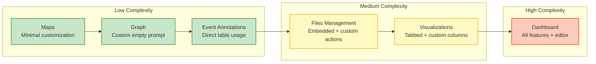
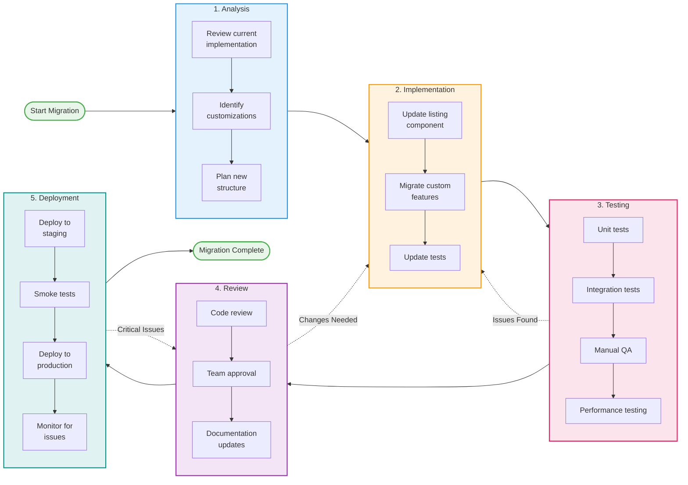

# ContentList Implementation Plan

## Document Purpose

This document provides a phased implementation plan for refactoring the current `TableListView` monolith into a composable `ContentList` architecture. This plan is designed for engineers and AI agents implementing the new system.

**Related Documents:**
- **[proposals/PROPOSAL_CONTENT_LIST_PAGE.md](./proposals/PROPOSAL_CONTENT_LIST_PAGE.md)** - High-level architecture and rationale
- **[LISTING_PROVIDER.md](./LISTING_PROVIDER.md)** - ContentListProvider implementation guide
- **[LISTING_COMPONENT.md](./LISTING_COMPONENT.md)** - UI components specification
- **[LISTING_PAGE.md](./LISTING_PAGE.md)** - ContentListPage component specification
- **[reference/CURRENT_USAGE.md](./reference/CURRENT_USAGE.md)** - Analysis of existing TableListView
- **[reference/ANALYSIS_DEFAULTS.md](./reference/ANALYSIS_DEFAULTS.md)** - Feature defaults strategy
- **[reference/ANALYSIS_HEADLESS.md](./reference/ANALYSIS_HEADLESS.md)** - Architecture decision (component-based, not headless)

---

## Table of Contents

1. [Implementation Overview](#implementation-overview)
2. [Phase 1: Core Provider & State Management](#phase-1-core-provider--state-management)
3. [Phase 2: Basic Rendering Components](#phase-2-basic-rendering-components)
4. [Phase 3: Advanced Features](#phase-3-advanced-features)
5. [Phase 4: Page Wrapper & Layout](#phase-4-page-wrapper--layout)
6. [Phase 5: Migration Support](#phase-5-migration-support)
7. [Phase 6: Consumer Migrations](#phase-6-consumer-migrations)
8. [Testing Strategy](#testing-strategy)
9. [Risk Management](#risk-management)

---

## Implementation Overview

### Goals

1. **Reduce complexity** - Break the monolithic component into focused components
2. **Improve flexibility** - Enable composition over configuration
3. **Maintain compatibility** - Support existing features
4. **Enable innovation** - Make new layouts (grid, cards) easy to add
5. **Improve DX** - Better TypeScript, clearer APIs, easier testing
6. **Address team requirements** - Add 3 new features from [#159995](https://github.com/elastic/kibana/issues/159995):
   - Initial filter state (Security team)
   - Preview popovers (Visualisation team)
   - Analytics hooks

### Architecture Approach

- **Component-based** - Provider-based architecture with composable UI components
- **Feature-based API** - Features enabled by default; pass `false` to disable, object for custom configuration
- **Compound components** - Flexible composition with clear hierarchy
- **Transform-based** - Datasource types converted to standardized `ContentListItem` format
- **Type-safe** - TypeScript enforces transform requirements based on datasource type

## Phase 1: Core Provider & State Management

**Goal:** Build the central state management provider

**Detailed Implementation:** See [LISTING_PROVIDER.md](./LISTING_PROVIDER.md)

### Overview

The `ContentListProvider<T>` is the foundational piece that:
- Accepts a generic type `<T>` for the item type being listed (e.g., Dashboard, Visualization)
- Manages all shared state (items, filters, sorting, pagination, selection)
- Provides React Context to child components
- Exposes type-safe hooks (`useContentListState`, `useContentListActions`, `useContentListSelection`)
- Handles automatic data fetching and state synchronization

### Package Structure

**Strategy:** Create packages incrementally, one per phase. This avoids upfront complexity while maintaining clear boundaries.

#### Phase 1 Package

Create `@kbn/content-list-provider` package containing:
- **Provider component** - React Context provider with state management
- **State reducer** - Handles all state mutations (search, filter, sort, pagination, selection)
- **Data fetching hook** - Auto-fetches on parameter changes, exposes manual refetch
- **Consumer hooks** - Separate hooks for reading state, mutations, and selection

**Why incremental?**
- Reduces initial overhead (no empty package scaffolding)
- Each package ships with working code and tests
- Dependencies are clear (each new package depends on previous ones)
- Easier to review (package creation tied to feature delivery)

### Key Design Principles

1. **Transform-Based Architecture** - Generic `<T>` only at datasource boundary; all UI works with standardized `ContentListItem`
2. **Type-Safe Transform Requirements** - TypeScript enforces transform function when needed based on datasource type
3. **Features Enabled by Default** - Search, sorting, filtering, and pagination enabled with sensible defaults
4. **State Nested, Config Flat** - Dynamic state is nested under `state`, config props are top-level
5. **Shared Base Configuration** - `ContentListConfig<T>` interface shared between props and context
6. **Read-Only Mode** - Disables `actions` when `isReadOnly={true}` for safety
7. **Automatic Page Resets** - Resets to page 1 on search/filter/sort changes
8. **Memoized Callbacks** - All hooks use `useCallback` to prevent unnecessary re-renders

### Implementation Tasks

#### 1.1: Create Provider Shell
- Define `ContentListState<T>` interface with generic type parameter
- Define `ContentListContextValue<T>` interface (state + config + dispatch)
- Implement `ContentListProvider<T>` component with React Context
- Add memoization for context value

#### 1.2: Build State Reducer
- Define `ContentListAction<T>` union type with generic (12 action types)
- Implement `reducer<T>` function with immutable updates
- Add automatic page reset on search/filter/sort changes
- Handle selection operations (toggle, clear, select all)

#### 1.3: Add Data Fetching
- Implement `useFetchItems` hook
- Auto-fetch on dependency changes (search, filters, sort, page)
- Expose `refetch` function for manual refresh
- Handle loading and error states

#### 1.4: Create Consumer Hooks
- `useContentListState()` - Read state and config
- `useContentListActions()` - State mutation functions
- `useContentListSelection()` - Selection management
- Add error handling for usage outside provider

---

## Phase 2: Basic Rendering Components

**Goal:** Build table renderer, toolbar with filtering, footer, and modals

### Package Structure

#### Phase 2 Packages

Create the following packages in this phase:
- **`@kbn/content-list-table`** - Table renderer component
- **`@kbn/content-list-toolbar`** - Toolbar component (search, filters, actions)
- **`@kbn/content-list-footer`** - Footer component (pagination)
- **`@kbn/content-list-modals`** - Shared modal components (delete confirmation)

**Dependencies:**
```
@kbn/content-list-table    → depends on @kbn/content-list-provider
@kbn/content-list-toolbar  → depends on @kbn/content-list-provider
@kbn/content-list-footer   → depends on @kbn/content-list-provider
@kbn/content-list-modals   → depends on @kbn/content-list-provider
```

### Tasks

#### 2.1: ContentListTable Component

**File:** `components/table/content_list_table.tsx`

Build table renderer with:
- Integration with EUI's `EuiBasicTable`
- Configurable columns (custom + built-in)
- Row selection support
- Row actions menu
- Item click/navigation handling
- Loading and error states
- Empty state rendering
- Responsive design

**Key Features:**
- Default columns: Name, Last Updated, Actions (if `item.actions` configured)
- `columns` prop: Supports both static array and function for customization
- `builtInColumns` prop: Configure or disable built-in columns
- Smart defaults: Auto-renders based on provider configuration
- Expandable rows support

See [LISTING_COMPONENT.md](./LISTING_COMPONENT.md#contentlisttable) for complete API specification and examples.

#### 2.2: ContentListToolbar Component

**File:** `components/toolbar/content_list_toolbar.tsx`

Build toolbar container with smart defaults:
- Auto-renders SearchBox, Filters, and BulkActions based on provider configuration
- Uses `useContentListState()` hook to access config and state
- Supports custom children for full layout control
- Compound component pattern for granular customization

**Sub-components:**
- `Toolbar.SearchBox` - Text input with search icon
- `Toolbar.BulkActions` - Bulk action buttons (delete, export, custom)
- `Toolbar.Filters` - Filter container with Sort (done), Tags, Favorites, CreatedBy (see 2.3)
- `Toolbar.Button` - Pre-styled button wrapper for consistency

See [LISTING_COMPONENT.md](./LISTING_COMPONENT.md#contentlisttoolbar) for complete API specification and examples.

#### 2.3: Filtering Components

**Goal:** Complete filter UI components inside toolbar

**Package:** `@kbn/content-list-toolbar` (filters/ directory)

Build dedicated filter UI components that render actual UI (not declarative markers):

##### 2.3.1: Tag Filter (`Filters.Tags`)
- Multi-select tag picker using `@kbn/content-management-tags` (already wired in provider)
- Renders `EuiFilterButton` + popover with tag list
- Integrates with `useContentListFilters` hook to set `activeFilters.tags`
- **No new provider dependencies** - tags provider already integrated

##### 2.3.2: Favorites Filter (`Filters.Favorites`)
- Toggle button (`EuiFilterButton`) for favorites-only view
- Integrates with `useContentListFilters` to set `activeFilters.favoritesOnly`
- Only renders when `config.favorites` is enabled
- **No new provider dependencies** - favorites already in provider config

##### 2.3.3: User Filter (`Filters.CreatedBy`)
- **Prerequisite:** Wrap `ContentListKibanaProvider` with `UserProfilesKibanaProvider`
- Uses `UserProfilesPopover` from `@kbn/user-profile-components`
- Uses `useUserProfiles` from `@kbn/content-management-user-profiles`
- Derives `allUsers` from items via `useContentListItems()`
- Handles `NULL_USER` for items without creator
- Integrates with `useContentListFilters` to set `activeFilters.users`

##### 2.3.4: Search Box Parser Integration
- **Prerequisite:** Add `searchQueryParser?: SearchQueryParser` to provider services
- **Prerequisite:** Wire up in `ContentListKibanaProvider` using `savedObjectsTagging.ui.parseSearchQuery`
- Update `useContentListSearch` to use parser when available
- Parse `tag:foo` syntax and update `activeFilters.tags` accordingly
- Fall back to basic text search if parser not provided

#### 2.4: ContentListFooter Component

**File:** `components/footer/content_list_footer.tsx`

Build footer with pagination:
- Auto-renders pagination if enabled in provider
- Supports custom children for additional footer content
- Compound components (Left, Center, Right) for flexible layouts
- Uses `useContentListState()` to access pagination config

**Sub-component:**
- `Footer.Pagination` - EUI pagination controls

See [LISTING_COMPONENT.md](./LISTING_COMPONENT.md#contentlistfooter) for complete API specification and examples.

#### 2.5: DeleteModal Component

**File:** `components/modals/delete_modal.tsx`

Standalone confirmation modal for delete operations:
- Displays list of items to be deleted
- Confirmation button with loading state
- Customizable title and button text
- Optional custom item rendering

See [LISTING_COMPONENT.md](./LISTING_COMPONENT.md#deletemodal) for complete API specification and examples.

### Testing

**Unit Tests:**
- Table renders with various column configurations
- Table handles selection correctly
- Toolbar renders smart defaults
- Toolbar renders custom children
- Filter components integrate with useContentListFilters
- Tag filter shows available tags and updates activeFilters.tags
- Favorites filter toggles activeFilters.favoritesOnly
- User filter shows user list and updates activeFilters.users
- Search parser integration handles tag:foo syntax
- Footer renders pagination when enabled
- DeleteModal shows correct confirmation text

**Visual Tests:**
- Storybook stories for all rendering variants
- Different column configurations
- Filter states (active filters, filter counts)
- Empty states
- Loading states
- Error states
- Selection states

---

## Phase 3: Advanced Features

**Goal:** Implement grid layout, custom actions, and edge cases

### Package Structure

#### Phase 3 Packages

Create the following packages in this phase:
- **`@kbn/content-list-grid`** - Grid/card layout renderer (alternative to table)

**Dependencies:**
```
@kbn/content-list-grid → depends on @kbn/content-list-provider
```

### Tasks

#### 3.1: ContentListGrid Component

**File:** `components/grid/content_list_grid.tsx`

Alternative rendering mode for card/grid layouts:
- Custom item rendering via render function
- Responsive column configuration
- Loading, error, and empty states
- Consistent item interactions (onClick, getHref, actions) via provider

**Key Features:**
- Configurable columns and gutter size
- Uses `useContentListState()` for state management
- Item interactions defined on provider (not grid component)
- Flexible card rendering

See [LISTING_COMPONENT.md](./LISTING_COMPONENT.md#contentlistgrid) for complete API specification and examples.

#### 3.2: Custom Bulk Actions

Extend `Toolbar.BulkActions` to support custom actions beyond delete/export:
- Configurable action buttons
- Icon and color customization
- Conditional enabling/disabling
- Confirmation dialog support

See [LISTING_COMPONENT.md](./LISTING_COMPONENT.md#toolbarbulkactions) for complete API specification.

#### 3.3: Recently Accessed Integration

Add recently accessed sorting to provider:
- Automatically adds "Recently accessed" to sort options
- Integrates with existing Kibana recently accessed service
- Sorts items by access timestamp (most recent first)
- Optional `add()` method to track new accesses

See [LISTING_PROVIDER.md](./LISTING_PROVIDER.md) for integration details and API.

#### 3.4: Empty State Variations

Support different empty state scenarios:
- **No items** - First-time use, show create action
- **No results** - Search/filter returned nothing, offer to clear
- **Error** - Something went wrong, offer retry

**Implementation:**
- Auto-detect variant based on state (items, isLoading, error, hasActiveFilters)
- Customizable via `emptyState` prop on Table/Grid
- Entity-aware messaging using `entityName` and `entityNamePlural`

See [LISTING_COMPONENT.md](./LISTING_COMPONENT.md) for empty state customization examples.

#### 3.5: Preview Popovers

**Requirement:** Visualisation team wants preview on hover ([#162084](https://github.com/elastic/kibana/issues/162084))

**File:** `components/table/table_row_preview.tsx`

Add preview popover support to table rows:
- Hover or click trigger options
- Custom render function for preview content
- Configurable size and position
- Debounced hover (300ms) to prevent flicker
- Keyboard accessible (Escape to close)
- Portal rendering to avoid z-index issues

See [LISTING_COMPONENT.md](./LISTING_COMPONENT.md) for preview configuration and examples.

#### 3.6: Analytics & Telemetry Hooks

**Requirement:** Content Management needs usage metrics ([#160016](https://github.com/elastic/kibana/issues/160016))

Add telemetry hooks to provider for tracking user interactions:
- Item views and clicks
- Search queries
- Filter changes
- Sort changes
- Bulk actions

**Implementation:**
- Non-blocking calls (don't wait for telemetry)
- Error boundaries around analytics
- Hooks called at appropriate action points
- Integration guide for Kibana telemetry service

See [LISTING_PROVIDER.md](./LISTING_PROVIDER.md) for analytics API and integration examples.

#### 3.7: Responsive Design

Ensure components work on mobile:
- Stack toolbar elements vertically on small screens
- Hide less important columns in table
- Adjust grid columns for mobile
- Touch-friendly tap targets

#### 3.8: Accessibility

Full a11y support:
- Keyboard navigation for all interactions
- Screen reader announcements for state changes
- ARIA labels for all controls
- Focus management in modals
- Skip links for large tables

### Testing

**Unit Tests:**
- Grid renders items correctly
- Custom bulk actions work
- Recently accessed sorting
- Empty state variations
- Responsive behavior

**Accessibility Tests:**
- Keyboard navigation
- Screen reader support
- ARIA labels
- Focus management

**Visual Regression Tests:**
- Responsive layouts
- Empty states
- Loading states
- Error states
- A11y tests
- Visual regression tests

---

## Phase 4: Page Wrapper & Layout

**Goal:** Build optional page wrapper with header and tabs

### Package Structure

#### Phase 4 Packages

Create the following packages in this phase:
- **`@kbn/content-list-page`** - Page-level layout component (header, tabs, content area)
- **`@kbn/content-list`** - Main barrel export package that re-exports all other packages

**Dependencies:**
```
@kbn/content-list-page → no dependencies (layout only, works with any content)
@kbn/content-list      → re-exports all packages (convenience package)
```

**Final Package Architecture:**
```
@kbn/content-list-provider    (state management + services)
         ↓
    ┌────┼────┬────┬────┐
    ↓    ↓    ↓    ↓    ↓
  table grid toolbar footer modals
         ↓
@kbn/content-list-page        (layout wrapper)
         ↓
@kbn/content-list             (barrel export - all packages)
```

### Tasks

#### 4.1: ContentListPage Component

**File:** `components/page/content_list_page.tsx`

Optional page layout wrapper with Kibana page template integration:
- Configurable width restrictions
- Padding and spacing controls
- Compound components for slots (Header, Section)
- Consistent with Kibana page patterns

**Key Features:**
- Optional (use for full-page listings, omit for embedded usage)
- Wraps `KibanaPageTemplate` for consistency
- Simple compound component API

See [LISTING_PAGE.md](./LISTING_PAGE.md) for complete API specification and examples.

#### 4.2: Header Component

**File:** `components/page/header.tsx`

Page header with built-in tabs support:
- Title, description, and breadcrumbs
- Automatic tab state management with URL sync
- Compound component API (Header.Right, Header.Tab, Header.Bottom)
- Right-side action slots

**Key Features:**
- Tab state synced to URL (`?tab=visualizations`)
- Extracts tabs from children automatically
- Simple declarative API
- No manual state management needed

See [LISTING_PAGE.md](./LISTING_PAGE.md) for complete API specification and tab examples.

#### 4.3: URL Tab State Hook

**File:** `services/use_url_tab.ts`

Custom hook for managing tab state synced with URL:
- Reads initial tab from URL query parameter
- Updates URL when tab changes
- Syncs with browser back/forward
- Falls back to provided initial tab

**Implementation:**
- Uses `useHistory` and `useLocation` from React Router
- URL parameter: `?tab=<tabId>`
- Replaces history (no back button spam)
- Syncs on URL changes via `useEffect`

See [LISTING_PAGE.md](./LISTING_PAGE.md) for implementation details.

### Testing

**Unit Tests:**
- ContentListPage renders children
- Header renders title and description
- Tab state management
- URL sync for tabs
- Breadcrumb integration

**Integration Tests:**
- Full page layout with list
- Tabbed variant with multiple tabs
- Tab switching persists to URL
- Header actions render correctly

---

## Phase 5: Migration Support

**Goal:** Create migration tooling and documentation

### Tasks

#### 5.1: Migration Guide Documentation

Create comprehensive migration guides:

**File:** `docs/migration-guide.md`

```markdown
# Migration Guide: TableListView → ContentListProvider

## Overview
This guide helps you migrate from the old `TableListView` to the new `ContentListProvider` architecture.

## Quick Reference

| Old API | New API |
|---------|---------|
| `<TableListView />` | `<ContentListProvider><ContentListTable /></ContentListProvider>` |
| `findItems` prop | `dataSource={{ findItems }}` prop |
| `initialPageSize` prop | `pagination={{ initialPageSize }}` prop |
| `customTableColumn` prop | `<ContentListTable columns={[...]} />` |
| `additionalRightSideActions` | `<Header.Right>` slot |
| `withoutPageTemplateWrapper` | Just omit `ContentListPage` wrapper |

## Step-by-Step Migration

### 1. Simple Listing (Maps pattern)

**Before:**
[show Maps code from PROPOSAL.md]

**After:**
[show migrated Maps code]

**Changes:**
- Wrap in `ContentListProvider`
- Feature-based props (`search={true}`)
- Use `isReadOnly` prop instead of conditional props

[Continue for all consumer types...]
```

**File:** `docs/api-reference.md`

Auto-generated from TypeScript types showing all interfaces.

**File:** `docs/examples.md`

Collection of common patterns and use cases.

#### 5.2: Codemods for Simple Migrations

**File:** `scripts/codemods/tablelistview-to-contentlist.ts`

Automated migration for simple cases:

```typescript
import { Transform } from 'jscodeshift';

const transform: Transform = (file, api) => {
  const j = api.jscodeshift;
  const root = j(file.source);
  
  // Find TableListView usages
  root.find(j.JSXElement, {
    openingElement: {
      name: { name: 'TableListView' }
    }
  }).forEach(path => {
    // Transform props
    const props = getPropsFromPath(path);
    
    // Generate new structure
    const newComponent = buildContentListProvider(props);
    
    // Replace
    j(path).replaceWith(newComponent);
  });
  
  return root.toSource();
};

export default transform;
```

**Supported transformations:**
- Simple prop mappings
- Feature-based prop conversion
- Basic composition patterns

**Not supported (manual migration required):**
- Complex custom implementations
- Tabbed variants
- Custom state management

#### 5.3: Compatibility Layer (Optional)

**File:** `src/table_list_view_compat.tsx`

Backwards compatibility wrapper:

```typescript
/**
 * @deprecated Use ContentListProvider instead
 * Compatibility wrapper for gradual migration
 */
export function TableListView<T>(props: TableListViewProps<T>) {
  console.warn('TableListView is deprecated. Migrate to ContentListProvider.');
  
  // Map old props to new structure
  const mappedProps = mapLegacyProps(props);
  
  return (
    <ContentListProvider {...mappedProps}>
      <ContentListToolbar />
      <ContentListTable />
      <ContentListFooter />
    </ContentListProvider>
  );
}
```

**Benefits:**
- Allows gradual migration
- Reduces immediate breakage
- Provides deprecation warnings

**Limitations:**
- Can't support all old features perfectly
- Performance may be slightly worse
- Still requires eventual migration

#### 5.4: Testing Utilities

**File:** `src/testing/test_helpers.tsx`

Helpers for testing consumer migrations:

```typescript
import { render } from '@testing-library/react';
import { ContentListProvider } from '../components';

export function renderContentList<T>(props: Partial<ContentListProviderProps<T>>) {
  const defaultProps = {
    entityName: 'test',
    entityNamePlural: 'tests',
    dataSource: {
      findItems: jest.fn().mockResolvedValue({ total: 0, hits: [] }),
    },
  };
  
  return render(
    <ContentListProvider {...defaultProps} {...props}>
      <ContentListTable />
    </ContentListProvider>
  );
}

export function mockDataSource<T>(items: T[]) {
  return {
    findItems: jest.fn().mockResolvedValue({
      total: items.length,
      hits: items,
    }),
  };
}
```

#### 5.5: Type Compatibility Helpers

**File:** `src/types/compat.ts`

Type utilities for migration:

```typescript
/**
 * Convert old TableListViewProps to new ContentListProviderProps
 */
export function convertTableListViewProps<T>(
  oldProps: TableListViewProps<T>
): ContentListProviderProps<T> {
  return {
    entityName: oldProps.entityName,
    entityNamePlural: oldProps.entityNamePlural,
    dataSource: {
      findItems: oldProps.findItems,
      onFetchSuccess: oldProps.onFetchSuccess,
    },
    search: oldProps.initialFilter ? { initialQuery: oldProps.initialFilter } : true,
    sorting: oldProps.customSortingOptions
      ? { options: oldProps.customSortingOptions }
      : true,
    pagination: oldProps.initialPageSize
      ? { initialPageSize: oldProps.initialPageSize }
      : true,
    selection: oldProps.deleteItems
      ? { onDelete: oldProps.deleteItems }
      : undefined,
    // ... continue mapping
  };
}
```

### Testing

**Migration Tests:**
- Run codemods on test files
- Verify output is valid TypeScript
- Compare behavior before/after
- Test compatibility layer

---

## Phase 6: Consumer Migrations

**Goal:** Migrate all 6 consumers to new architecture

### Migration Order (by complexity)



**Migration Sequence:**

1. **Maps** - Simplest, minimal customization
2. **Graph** - Simple with custom empty prompt
3. **Event Annotations** - Direct table usage
4. **Files Management** - Embedded usage, custom actions
5. **Visualizations** - Tabbed variant, custom columns
6. **Dashboard** - Most complex, all features

### Migration 1: Maps

**Complexity:** Low  
**Key Changes:**
- Replace `TableListView` with `ContentListProvider`
- Use `isReadOnly` prop
- Minimal code changes

**Before/After:** See [RECIPES.md - Migration 1](./RECIPES.md#migration-1-maps-simple-case)

**Tasks:**
- [ ] Update maps list component
- [ ] Test all CRUD operations
- [ ] Verify read-only mode works
- [ ] Update unit tests
- [ ] Update integration tests
- [ ] Get team approval

### Migration 2: Graph

**Complexity:** Low  
**Key Changes:**
- Custom empty prompt
- Sample data integration
- URL parameter initialization

**Tasks:**
- [ ] Update graph list component
- [ ] Migrate custom empty prompt
- [ ] Test sample data links
- [ ] Update tests
- [ ] Get team approval

### Migration 3: Event Annotations

**Complexity:** Low-Medium  
**Key Changes:**
- Uses `TableListViewTable` directly
- Custom columns
- Edit flyout integration

**Tasks:**
- [ ] Update to use `ContentListProvider`
- [ ] Migrate custom columns
- [ ] Test flyout integration
- [ ] Update tests
- [ ] Get team approval

### Migration 4: Files Management

**Complexity:** Medium  
**Key Changes:**
- Remove `withoutPageTemplateWrapper` hack
- Unlimited header actions
- Per-item actions via `actions.item.*` (extensible)

**Before/After:** See [RECIPES.md - Migration 2](./RECIPES.md#migration-2-files-management-embedded--custom-actions)

**Tasks:**
- [ ] Update files management component
- [ ] Remove `withoutPageTemplateWrapper`
- [ ] Add unlimited actions via provider's `actions` prop
- [ ] Migrate per-item actions to `actions.item.*`
- [ ] Test all file kinds
- [ ] Update tests
- [ ] Get team approval

### Migration 5: Visualizations

**Complexity:** Medium-High  
**Key Changes:**
- Migrate from `TabbedTableListView`
- Use `Header.Tab` compound components
- Custom columns and styling
- Complex empty prompt

**Before/After:** See [RECIPES.md - Migration 4](./RECIPES.md#migration-4-visualizations-tabbed-variant)

**Tasks:**
- [ ] Update visualizations list
- [ ] Migrate to tabbed header
- [ ] Migrate custom columns
- [ ] Remove custom CSS injection
- [ ] Migrate empty prompt
- [ ] Test all visualization types
- [ ] Update tests
- [ ] Get team approval

### Migration 6: Dashboard

**Complexity:** High  
**Key Changes:**
- Simplify `useDashboardListingTable` hook
- Migrate content editor integration
- Recently accessed integration
- Favorites support
- Unsaved dashboards list

**Before/After:** See [RECIPES.md - Migration 3](./RECIPES.md#migration-3-dashboard-complex-with-many-features)

**Content Editor Integration:**

Dashboard uses inline metadata editing. This is now a separate integration with a pre-existing package, `@kbn/content-management-content-editor`.

```typescript
import { useOpenContentEditor } from '@kbn/content-management-content-editor';

function DashboardListing() {
  const openEditor = useOpenContentEditor();
  
  const handleEdit = (item) => {
    openEditor({
      item: {
        id: item.id,
        title: item.attributes.title,
        description: item.attributes.description,
        tags: getTagsFromReferences(item.references),
        // ...
      },
      entityName: 'dashboard',
      onSave: async (updatedItem) => {
        await updateDashboardMetadata(updatedItem);
        await refetch();
      },
      customValidators: contentEditorValidators,
    });
  };
  
  return (
    <ContentListProvider
      item={{
        actions: { onEdit: handleEdit },
      }}
      {...otherProps}
    >
      {/* ... */}
    </ContentListProvider>
  );
}
```

See [LISTING_COMPONENT.md, Inline Metadata Editing](./LISTING_COMPONENT.md#inline-metadata-editing) for complete details.

**Tasks:**
- [ ] Update dashboard listing
- [ ] Simplify setup hook
- [ ] Migrate content editor
- [ ] Migrate recently accessed
- [ ] Migrate favorites
- [ ] Migrate unsaved list
- [ ] Test all workflows
- [ ] Update extensive test suite
- [ ] Performance testing
- [ ] Get team approval

### General Migration Process



**Detailed Steps:**

**1. Analysis**
- Review current implementation
- Identify customizations
- Plan new structure

**2. Implementation**
- Update list component
- Migrate custom features
- Update tests

**3. Testing**
- Unit tests
- Integration tests
- Manual QA
- Performance testing

**4. Review**
- Code review
- Team approval
- Documentation updates

**5. Deployment**
- Deploy to staging
- Smoke tests
- Deploy to production
- Monitor for issues

### Testing Strategy for Each Migration

**Functional Testing:**
- [ ] All CRUD operations work
- [ ] Search and filtering work
- [ ] Sorting and pagination work
- [ ] Custom features still work
- [ ] Error handling works
- [ ] Empty states render correctly

**Performance Testing:**
- [ ] Initial load time
- [ ] Search response time
- [ ] Large list performance (1000+ items)
- [ ] Bundle size comparison

**Visual Testing:**
- [ ] Screenshots match previous version
- [ ] Responsive design works
- [ ] Accessibility maintained

**Regression Testing:**
- [ ] Run full test suite
- [ ] Check for console errors
- [ ] Verify no functional regressions

---

## Testing Strategy

### Unit Testing

**Tools:** Jest, React Testing Library

**Coverage Targets:**
- All components: >85% coverage
- Hooks: >90% coverage
- Utilities: >95% coverage

**Test Categories:**

1. **Component Tests**
   - Props handling
   - Rendering variations
   - Event handling
   - Error states

2. **Hook Tests**
   - State management
   - Action dispatching
   - Context integration
   - Edge cases

3. **Utility Tests**
   - Query parsing
   - URL serialization
   - Filter building
   - Data transformation

### Integration Testing

**Tools:** Jest, React Testing Library, Mock Service Worker

**Test Scenarios:**

1. **Full Listing Flow**
   - Initial load
   - Search and filter
   - Sort and paginate
   - Select and delete

2. **URL State Sync**
   - URL updates on state change
   - State restores from URL
   - Browser back/forward
   - Direct URL navigation

3. **Service Integration**
   - Data fetching
   - Tag service
   - User profile service
   - Favorites service

### Visual Regression Testing

**Tools:** Storybook, Chromatic or Percy

**Coverage:**
- All component variations
- Empty states
- Loading states
- Error states
- Responsive layouts

### Performance Testing

**Metrics:**
- Initial render time
- Re-render performance
- Bundle size
- Memory usage

**Scenarios:**
- Small lists (10 items)
- Medium lists (100 items)
- Large lists (1000 items)
- Complex filtering
- Rapid interactions

### Accessibility Testing

**Tools:** axe-core, NVDA/JAWS, Lighthouse

**Checks:**
- Keyboard navigation
- Screen reader support
- ARIA labels
- Focus management
- Color contrast
- Touch targets (mobile)

### End-to-End Testing

**Tools:** Playwright or Cypress

**Critical Paths:**
- Create → List → Edit → Delete workflow
- Search and filter workflow
- Bulk operations workflow
- Tab navigation (for tabbed variant)

---

## Risk Management

```mermaid
quadrantChart
    title Risk Assessment Matrix
    x-axis Low Impact --> High Impact
    y-axis Low Probability --> High Probability
    
    quadrant-1 Monitor (High Impact, Low Probability)
    quadrant-2 Critical (High Impact, High Probability)
    quadrant-3 Low Priority (Low Impact, Low Probability)
    quadrant-4 Manage (Low Impact, High Probability)
    
    Performance Regression: [0.85, 0.3]
    Breaking Changes (during): [0.8, 0.3]
    Migration Burden: [0.75, 0.55]
    API Complexity: [0.5, 0.55]
    Adoption Resistance: [0.5, 0.55]
    Scope Creep: [0.5, 0.75]
    Breaking Changes (after): [0.8, 0.8]
```

### Risk 1: Migration Burden

**Impact:** High  
**Probability:** Medium  
**Mitigation:**
- Maintain old components during transition
- Provide codemods for simple cases
- Offer hands-on migration support
- Gradual rollout with early adopters
- Compatibility layer for emergency rollback

**Contingency:**
- If migrations take too long, extend support window
- Prioritize high-value consumers (Dashboard)
- Consider keeping compatibility layer permanently

### Risk 2: Performance Regression

**Impact:** High  
**Probability:** Low  
**Mitigation:**
- Benchmark all new components vs old
- Performance tests in CI
- Monitor bundle size continuously
- Profile complex interactions
- Load test with 1000+ items

**Contingency:**
- Optimize hot paths
- Lazy load non-critical features
- Consider memoization strategies
- Profile and fix bottlenecks

### Risk 3: API Complexity

**Impact:** Medium  
**Probability:** Medium  
**Mitigation:**
- Sensible defaults for common cases
- Progressive enhancement pattern
- Comprehensive examples
- Type-driven development
- Gather feedback early and often

**Contingency:**
- Simplify API based on feedback
- Add higher-level convenience components
- Improve documentation
- Provide more examples

### Risk 4: Breaking Changes

**Impact:** High  
**Probability:** Low (during migration), High (after deprecation)  
**Mitigation:**
- Semantic versioning
- Long deprecation window
- Clear migration paths
- Breaking change announcement
- Community feedback period

**Contingency:**
- Extend deprecation window
- Provide emergency compatibility shim
- Prioritize fixing breaking issues
- Roll back if necessary

### Risk 5: Adoption Resistance

**Impact:** Medium  
**Probability:** Medium  
**Mitigation:**
- Start with high-value migrations (Dashboard)
- Demonstrate clear benefits
- Collect and act on feedback
- Regular demos and updates
- Success stories and testimonials

**Contingency:**
- Focus on willing adopters first
- Don't force migrations
- Keep old API longer if needed
- Address concerns directly

### Risk 6: Scope Creep

**Impact:** Medium  
**Probability:** High  
**Mitigation:**
- Clear phase boundaries
- Resist adding new features during development
- Focus on feature parity first
- New features can come in v2
- Regular scope reviews

**Contingency:**
- Defer non-critical features
- Split into additional phases

---

## Appendix

### Related Documents

- **[proposals/PROPOSAL_CONTENT_LIST_PAGE.md](./proposals/PROPOSAL_CONTENT_LIST_PAGE.md)** - High-level architecture proposal
- **[LISTING_PAGE.md](./LISTING_PAGE.md)** - ContentListPage specification
- **[LISTING_COMPONENT.md](./LISTING_COMPONENT.md)** - ContentListProvider specification
- **[reference/CURRENT_USAGE.md](./reference/CURRENT_USAGE.md)** - Current TableListView analysis
- **[reference/CURRENT_FEATURES.md](./reference/CURRENT_FEATURES.md)** - Complete feature inventory
- **[reference/CURRENT_IMPL.md](./reference/CURRENT_IMPL.md)** - Technical implementation details
- **[reference/ANALYSIS_DEFAULTS.md](./reference/ANALYSIS_DEFAULTS.md)** - Feature defaults strategy
- **[reference/ANALYSIS_HEADLESS.md](./reference/ANALYSIS_HEADLESS.md)** - Architecture decision rationale

### Architecture Decisions

1. **Component-based** - Provider with composable UI components
2. **Features enabled by default** - Search, sorting, filtering, and pagination enabled with sensible defaults
3. **Feature-based API** - `search={true}` over scattered boolean flags
4. **Compound components** - `<Header.Right>` over `rightSlot` props
5. **Smart defaults** - Components auto-render based on provider config
6. **Separate content editor** - Not part of listing, integrated via hook

### Team Contacts

- **Content Management Team:** Primary implementation team
- **Dashboard Team:** Early adopter, most complex consumer
- **Visualizations Team:** Tabbed variant, custom columns
- **Maps Team:** Simplest consumer, good starting point
- **Design System Team:** EUI patterns and accessibility

### Resources

- **EUI Documentation:** https://eui.elastic.co/
- **Kibana Plugin Development:** https://www.elastic.co/guide/en/kibana/current/development.html
- **React Compound Components:** https://kentcdodds.com/blog/compound-components-with-react-hooks
- **TypeScript Generics:** https://www.typescriptlang.org/docs/handbook/2/generics.html
